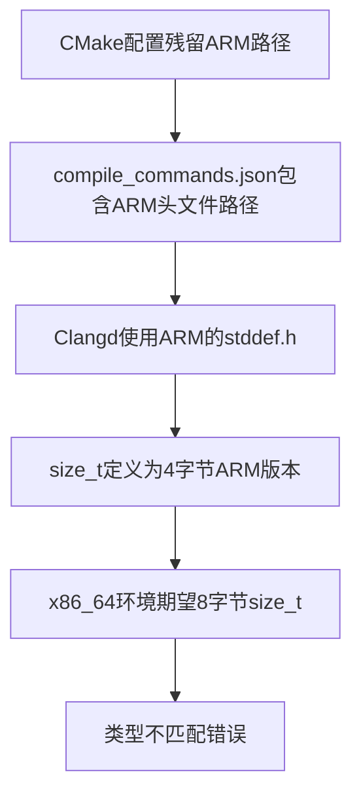

[TOC]
# C/C++开发者的光荣与哀愁：在兼容性与创新间的钢丝行走

## 背景
# ABI兼容性问题深度解析：从CMocka头文件错误说起

> *当size_t找不到定义时，问题往往不在于头文件本身，而在于编译器寻找头文件的路径指向了错误的架构。*

---

## 🎯 问题现象

在使用CMocka进行单元测试时，经常遇到以下错误：
- `size_t` 类型未定义
- 头文件找不到或版本不匹配
- Clangd等工具报告类型错误

**根本原因**：ABI不兼容导致的连锁反应

---

## 🔍 ABI是什么？

### 定义
**ABI (Application Binary Interface)** 是应用程序二进制接口，定义了编译后的二进制代码如何与操作系统、硬件以及其他二进制模块交互的底层规则。

### ABI的关键要素

| 组件 | 说明 | 示例 |
|------|------|------|
| **数据类型大小** | 基本类型在不同架构上的字节数 | `size_t`在x86_64是8字节，ARM32是4字节 |
| **内存布局** | 结构体成员顺序、填充字节位置 | 结构体对齐规则 |
| **函数调用约定** | 参数传递方式、寄存器使用规则 | 参数通过寄存器还是栈传递 |
| **符号命名** | 编译器如何编码函数名、变量名 | C++的名称修饰机制 |

### 不同架构的差异

```c
// x86_64 架构
sizeof(size_t) == 8    // 64位
sizeof(long) == 8      // 64位

// ARM32 架构  
sizeof(size_t) == 4    // 32位
sizeof(long) == 4      // 32位
```

---

## ⚡ 问题的连锁反应

### 1. 问题起点
- CMocka库使用ARM工具链编译
- 或CMake配置残留了ARM交叉编译设置

### 2. 头文件路径混乱
```bash
# 错误的编译命令（指向ARM头文件）
gcc -I/usr/arm-linux-gnueabihf/include ...

# 正确的编译命令（指向x86_64头文件）
gcc -I/usr/include/x86_64-linux-gnu ...
```

### 3. 连锁反应过程



### 4. 具体表现
- **类型大小不匹配**：`size_t`被解释为4字节（ARM），而x86_64期望8字节
- **内存布局错位**：结构体填充规则不同导致内存访问错误
- **符号未定义**：Clangd找不到正确的类型定义

---

## 🔧 解决方案

### 方案一：彻底清理CMake配置

```bash
# 1. 删除构建缓存
rm -rf build/
rm -rf cmake-build-*/

# 2. 重新生成构建文件
mkdir build && cd build
cmake .. -DCMAKE_BUILD_TYPE=Debug

# 3. 检查生成的compile_commands.json
grep -i "arm\|aarch" compile_commands.json
# 应该没有任何ARM相关路径
```

### 方案二：显式指定正确的头文件路径

```cmake
# CMakeLists.txt 中添加系统头文件路径
target_include_directories(your_test_target 
    SYSTEM PUBLIC 
    /usr/include/x86_64-linux-gnu
    /usr/include
)
```

### 方案三：确保头文件包含顺序

```c
// ✅ 正确的包含顺序
#include <stddef.h>    // 确保size_t定义
#include <stdint.h>    // 其他标准类型
#include <stdio.h>     // 常用标准库
#include <cmocka.h>    // 第三方库

// ❌ 错误的顺序
#include <cmocka.h>    // size_t可能未定义
#include <stddef.h>    // 太晚了
```

---

## 📋 解决步骤总结

### 步骤1：诊断问题
```bash
# 检查当前工具链
gcc -v
clang -v

# 检查头文件搜索路径
echo | gcc -E -Wp,-v -
```

### 步骤2：清理环境
```bash
# 清理CMake缓存
rm -rf build/ CMakeCache.txt CMakeFiles/

# 重新配置
cmake -B build -S .
```

### 步骤3：验证修复
```bash
# 检查编译数据库
cat build/compile_commands.json | jq '.[0].command'

# 重启Clangd
pkill clangd
# 重新打开编辑器
```

### 步骤4：测试编译
```bash
cd build
make
./your_test_program
```

---

## 💡 最佳实践

### 🎯 预防措施
1. **分离交叉编译环境**：为不同架构创建独立的构建目录
2. **使用工具链文件**：通过`CMAKE_TOOLCHAIN_FILE`明确指定目标架构
3. **检查编译数据库**：定期验证`compile_commands.json`的正确性

### 🔍 调试技巧
```bash
# 查看预处理器定义
gcc -E -dM - < /dev/null | grep -i size

# 检查库的架构
file /usr/lib/x86_64-linux-gnu/libcmocka.so

# 查看符号表
nm -D /usr/lib/x86_64-linux-gnu/libcmocka.so | grep size
```

### 📚 头文件包含原则
- **标准库优先**：先包含系统标准头文件
- **第三方库其次**：再包含外部库头文件
- **项目头文件最后**：最后包含项目内部头文件

---

## 🚀 总结

ABI兼容性问题的本质是**架构不匹配**导致的底层接口冲突。解决这类问题的关键是：

1. **识别根因**：问题往往源于工具链或构建配置的架构混乱
2. **统一环境**：确保编译器、头文件、库文件在架构上的一致性
3. **验证修复**：通过多种方式验证ABI的正确性

> 💡 **记住**：当遇到"找不到类型定义"的错误时，先检查是否存在ABI不匹配，而不是急着添加头文件包含。

---

*🔗 相关链接：*
- [GCC Cross-Compilation](https://gcc.gnu.org/onlinedocs/gcc/Cross_002dCompilation.html)
- [CMake Toolchain Files](https://cmake.org/cmake/help/latest/manual/cmake-toolchains.7.html)
- [System V ABI Specification](https://refspecs.linuxbase.org/elf/x86_64-abi-0.99.pdf)

## 调侃文
> *在C++26与C23的演进道路上，开发者们始终在自由与约束、创新与兼容的钢丝上行走。每一次标准的迭代，既是对底层机器的驯服，也是对历史包袱的妥协。*

---

## ⚔️ 一、ABI兼容性：永恒的战场

### "链接错误是我们的日常祷文"

当GCC 5.1为`std::string`引入C++11 ABI时，新旧库的符号分裂（`std::string` vs `std::__cxx11::string`）让开发者深陷两难：要么用`_GLIBCXX_USE_CXX11_ABI=0`强行回退，要么重编译所有依赖——而若项目同时依赖阿里云SDK（旧ABI）和Ceph（新ABI），则注定无解。

> **💭 心声：**  
> *"我们不是怕改变，而是怕改变的无序性。ABI断裂像一场无声的内战：胜利者只有编译器厂商，而开发者是战场上的清道夫。"*

### C的纯粹 vs C++的复杂

C的ABI稳定源于极简：基本类型+结构体，内存布局一目了然。而C++的虚函数表、RTTI、模板实例化，让二进制兼容成为"玄学"。开发者被迫用C接口包裹C++库，牺牲封装性换取跨版本兼容。

> **💭 心声：**  
> *"C++教会我们面向对象，却逼我们用C的骨灰当粘合剂——这是技术的返祖，还是进化的代价？"*

---

## ⏳ 二、标准化：迟缓的正义

### 十年一版，等不起的开发者

C标准从C99到C23间隔24年，C++从C++11到C++26虽提速至三年一版，但关键痛点（如模块化、并发安全）仍进展缓慢。相比之下，Java/C#的快速迭代让C/C++开发者感到"被时代遗弃"。

> **💭 心声：**  
> *"我们理解委员会对稳定性的执着，但当constexpr求值都要等二十年，而隔壁Rust已实现编译时函数执行时——耐心成了奢侈品。"*

### 分裂的标准库：开发者的地狱

C++标准库的ABI因编译器版本（GCC vs Clang）、操作系统（Windows vs Linux）甚至编译选项（`-D_GLIBCXX_USE_CXX11_ABI`）而碎片化。开发者被迫成为"版本侦探"：用`nm`查符号、用`c++filt`解修饰、用`readelf`扒编译器指纹。

> **💭 心声：**  
> *"我们写的不是业务逻辑，而是ABI占卜术——在符号的迷宫里，寻找那微弱的兼容性烛光。"*

---

## ⚖️ 三、语言演进：创新的枷锁

### C兼容性：甜蜜的毒药

C++为兼容C保留`longjmp`、隐式类型转换等"危险特性"，导致安全漏洞频发（如缓冲区溢出）。而C23引入的`constexpr`函数求值、编译时测试等特性，反而让C++开发者质问："为何ImportC能做的，我们还要等？"

> **💭 心声：**  
> *"C是C++的母语，也是它的口吃——每一次为兼容C的语法扭曲，都是对现代C++安全性的背叛。"*

### 模板元编程：天才的诅咒

C++模板的图灵完备性催生了Boost、Loki等神级库，但也导致编译错误信息如天书、编译时间暴涨。开发者哀叹："STL的泛型魔法，代价是IDE卡成幻灯片，而调试模板崩溃犹如解读上古卷轴。"

> **💭 心声：**  
> *"模板是编译器的谜题，却是开发者的刑具——我们在类型推导的地狱里，仰望泛型天堂的虚影。"*

---

## 🛠️ 四、底层驯服：孤独的荣耀

### 内存管理：自由的牢笼

C/C++将内存控制权交给开发者，但`malloc/new`的滥用易导致内存泄漏、野指针。尽管C++11引入智能指针，但与传统C库（如OpenSSL）交互时，仍需在"手动管理"与"安全封装"间走钢丝。

> **💭 心声：**  
> *"我们握着内存的权柄，也戴着它的镣铐——一次use-after-free的错误，足以让三天三夜的调试化为灰烬。"*

### 跨平台：统一的幻觉

Windows的COM、Linux的Itanium ABI、嵌入式系统的定制编译链——所谓"跨平台C++"，实则是为每个平台重写一层适配胶水。开发者自嘲："`#ifdef _WIN32`是我们的第二语法。"

> **💭 心声：**  
> *"跨平台是写在文档里的童话，藏在宏定义里的现实。"*

---

## 💎 结语：在刀锋上跳舞的匠人

*"机器层赋予我们接近金属的自由，却要我们以兼容性为赎金；标准库承诺了抽象的力量，却用ABI的锁链将我们束缚。每一次在`extern "C"`的接口后隐藏C++的优雅，每一次为旧库放弃C++17的`std::optional`——都是对现实的妥协，也是对底层的更深驯服。"*

*"我们既是历史的守墓人（兼容C），也是未来的拓荒者（拥抱C++26）。在二进制兼容的废墟上，我们搭建着通往未来的桥——桥下是ABI断裂的深渊，桥上是我们永不妥协的代码信仰。"*

**这便是C/C++程序员的光荣与哀愁：以兼容性为舟，以底层逻辑为桨，在时代的洪流中，划向不被定义的远方。**

---

*🚀 愿每一位在底层世界深耕的开发者，都能在钢丝上找到属于自己的平衡点。*